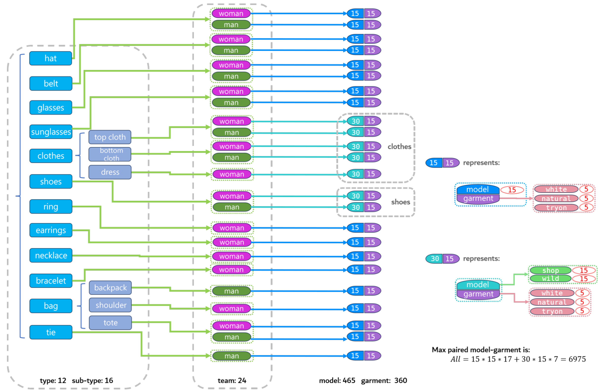

# OmniTry-Bench: A Comprehensive Benchmark for Virtual Try-on Anything


<p><b>OmniTry-Bench</b> introduces a comprehensive and diverse benchmark for virtual try-on task, enabling thorough evaluation of common wearable objects across 12 types.</p>

The benchmark dataset can be downloaded from [OmniTry-Bench](https://huggingface.co/datasets/kunbyte/OmniTry-Bench).

## Constitution of Benchmark


As the above Figure, we gather evaluation samples within 12 common types of wearable objects, which can be summarized into 4 major classes: clothes, shoes, jewelries and accessories.

We consider detailed sub-types if necessary, such as the class <i>bag</i> consisted of the backpack, shoulder and tote bags.
<i>Clothes</i> are divided into top cloth, bottom cloth, and dress. Each sub-type contains two gender groups (woman and man), with the exceptions that <i>jewelries</i> and <i>dress</i> exclusively contain woman samples, while <i>tie</i> contains only man samples. 

Each gender group includes 15 person images, where the garments are categorized into three settings: white background, natural background, and try-on setting. Every garment setting include 5 images.
Following previous work's categorization of virtual try-on scenarios into <i>in-shop</i> and <i>in-the-wild</i>, we further divide the person images for <i>clothes</i> and <p><i>shoes</i> into 15 shop-style and 15 wild-style samples per gender group, resulting in 30 person images per sub-type. Other person images are labeled with <i>wild</i> or <i>shop</i> at the end of their filenames.

The benchmark predominantly sources images from public repositories ([Pexels](https://www.pexels.com)), supplemented with brand website materials and social media content under compliant data usage protocols.

### Benchmark Structure
Make sure the downloaded paired dataset (person-object) are organized according to the following folder structure:
```
OmniTry_Bench/
├── bag/
|    ├── backpack/
|    |    └── man/
|    |         ├── object/
|    |         |     ├── clean/
|    |         |     |     ├── 101_backpack_XX-color.jpg
|    |         |     |     └── ...            
|    |         |     ├── natural/
|    |         |     |     ├── 201_backpack_XX-brown.jpg
|    |         |     |     └── ... 
|    |         |     └── tryon/
|    |         |           ├── 301_backpack_XX-gray.jpg
|    |         |           └── ... 
|    |         └── person/
|    |               ├── 001_backpack_XX_shop.jpg
|    |               └── ...
|    ├── shoulder/
|    |    └── woman/
|    |         └── ...
|    └── tote
|         └── ...
|
...
└── tie/
     └── man/
          └── ...
- omni_vtryon_bench_v1.json
- omni_vtryon_bench_small_v1.json
```
- `bag/tie`: The object types
- `backpack/shoulder`: The object subtypes
- `woman/man`: The gender groups
- `object`: The wearable object images, with the <i>id</i> at the beginning of the filename, and the main color of object at the end of filename.
- `person`: The persons in the shop/wild style, with the <i>id</i> at the beginning of the filename.


There are two try-on index json files. `omni_vtryon_bench_v1.json` contains the full benchmark dataset with 6,975 combinatorial person-object pairs across 12 wearable categories. Its subset `omni_vtryon_bench_small_v1.json` provides 360 curated image pairs sampled under balanced constraints (15 models per type, 7 shop-style/8 wild-style distribution), serving as the core evaluation set for virtual try-on experiments. Both files include metadata annotations for all object types and environmental settings. 
The try-on paired items of json files are detailed as the following structure:
```
    {
        "id": "bag_backpack_man_001_101",
        "person": {
            "id": "001",
            "img_path": "OmniTry_Bench/bag/backpack/man/person/001_backpack_back-of-mens-white-shirt_shop.jpg",
            "caption": "the back view of a person standing against a plain white background. The individual is wearing a plain white T-shirt and light green shorts. The person has short, light brown hair that is neatly styled. The posture is relaxed, with the arms hanging naturally by the sides. The lighting in the image is even, highlighting the simplicity of the outfit and the clean background."
        },
        "object": {
            "id": "101",
            "img_path": "OmniTry_Bench/bag/backpack/man/object/clean/101_backpack_R-C-color.jpg",
            "caption": "Jurassic Park-themed backpack with black, yellow, and red accents."
        },
        "gt": {
            "caption": "A young man standing in a studio with a white background. He is wearing a white t-shirt with a crew neck and short sleeves. His hair is styled neatly, and he is facing away from the camera. He wears light green shorts. The man is now wearing a black backpack with yellow and red accents, featuring the Jurassic Park logo prominently displayed.",
            "caption_cate": "the back view of a person standing against a plain white background. The individual is wearing a plain white T-shirt and light green shorts. The person has short, light brown hair that is neatly styled. The posture is relaxed, with the arms hanging naturally by the sides. The lighting in the image is even, highlighting the simplicity of the outfit and the clean background. Wearing a bag on shoulder or in hand. Jurassic Park-themed backpack with black, yellow, and red accents."
        },
        "garment_class": "bag",
        "class_name": "bag_backpack_man"
    },
```
- `id`: The try-on paired item's ID, concated with the class name, ID of the person and ID of the object.
- `person`: The person information, include: person ID, person image path, and the caption generated by Qwen2 MLLM ([Qwen2.5-VL-7B-Instruct](https://huggingface.co/Qwen/Qwen2.5-VL-7B-Instruct)).
- `object`: The wearable object information, include: object ID, object image path, and the caption generated by Qwen2 MLLM.
- `garment_class`: The category name of object.
- `class_name`: The category name of the try-on pair.
- `gt`: The "caption" is generated descriptive prompts via Qwen2 MLLM.


## Evaluation Metrics
The objectives of try-on can be divided into three aspects. Since there is no ground-truth result in mask-free setting, we redesign the metrics as follows:
- `Object Consistency`: We crop the objects from the try-on and object images via masking, and compute the visual similarity using DINO and CLIP, with metrics noted as M-DINO and M-CLIP-I.
- `Person Preservation`: In contrast, we crop out the person from try-on and person images, and compute spatial-aligned similarity between them, i.e., LPIPS and SSIM.
- `Object Localization`: (i) Counting the success rate whether a visual grounding model detects the object, denoted as G-Accuracy. (ii) Computing the image-text similarity, noted as CLIP-I, between try-on image and a text describing the person trying on the object (generated by Qwen2 MLLM).

### Environment Preparation
Besides the basic environment setup of OmniTry, the evaluation requires the [Grounding DINO](https://github.com/IDEA-Research/Grounded-Segment-Anything) and [SAM](https://github.com/facebookresearch/segment-anything) for mask segmentation:

For [Grounding DINO](https://github.com/IDEA-Research/Grounded-Segment-Anything), it has been added as a submodule in this directory, you can prepare it by
```
# clone the code of Grounded-Segment-Anything
git submodule update --init --recursive
mv Grounded-Segment-Anything Grounded_Segment_Anything 

# download ckpts
cd checkpoints/
wget https://github.com/IDEA-Research/GroundingDINO/releases/download/v0.1.0-alpha/groundingdino_swint_ogc.pth
```

For installing [SAM](https://github.com/facebookresearch/segment-anything), run
```
pip install git+https://github.com/facebookresearch/segment-anything.git

# download ckpts
cd checkpoints/
weget https://dl.fbaipublicfiles.com/segment_anything/sam_vit_h_4b8939.pth
```

Install the required packages:
```
pip install pytorch_fid, lpips, torchmetrics
```


### Prepare Try-On Results
Download the benchmark files from [OmniTry-Bench](https://huggingface.co/datasets/kunbyte/OmniTry-Bench). Then run your own model based on `omni_vtryon_bench_small_v1.json`, and prepare the result files in format of `[class_name]_[person_ID]_[object_ID].jpg`. For examples: `bag_backpack_man_001_101.jpg`.

### Compute Metrics

There are two python files: `vtryon_get_mask.py` for detect the object mask in try-on results, `vtryon_metric.py` for computing the metrics.

Edit the <i>vtryon_get_mask.py</i> and <i>vtryon_metric.py</i> with your paths
```python
## the OmniTryBench index file
benchmark_file = '../OmniTry_Bench/omni_vtryon_benchmark_small_v1.json'
## the Try-on result direction
result_dir = "../evaluation_results/"
```

Then run the python files:
```bash
python vtryon_get_mask.py
python vtryon_metric.py
```
In the output result directory, corresponding mask images will be generated for each try-on result. The final evaluation metric scores will be recorded in two JSON files (<i>result_detail.json</i> and <i>result.json</i>).
